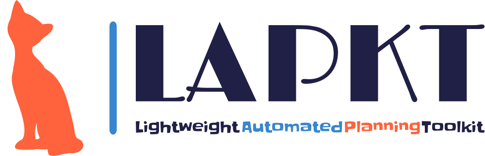

LAPKT aims to make your life easier if your purpose is to create, use or extend basic to advanced Automated Planners. It's an open-source Toolkit written in C++ and Python with simple interfaces that give you complete flexibility by decoupling parsers from problem representations and algorithms. It has been succesfully used in embedded systems, webservices, compilations, replanning and contains some of the high-performance planners from the last International Planning Competition 2014.

AUTHORS
=======

- Miquel Ramirez <miquel.ramirez@gmail.com>
- Nir Lipovetzky <nirlipo@gmail.com>
- Anubhav Singh <anubhav.singh.er@protonmail.com>
- Christian Muise <christian.muise@gmail.com>

OVERVIEW
===========

LAPKT separates search engines from the data structures used to represent
planning tasks. This second component receives the name of 'interface' since
it is indeed the interface that provides the search model to be solved.

Search engine components are meant to be modular, allowing users of LAPKT to
assemble and combine features of different search engines to come up with customized
search strategies, within reason and without sacrificing (much) efficiency. In order to
do so, LAPKT makes heavy use of C++ templates and the Static Strategy design pattern.
At the time of writing this, the modularity and decoupling of components isn't as high 
as I would like, there's still a lot of work to do :)

Pypi package (linux and windows): Jump right in!
=================================================
- Install package

		python3 -m pip install lapkt

- Checkout lapkt options

		lapkt_cmd.py -h

## Important platform requirements:

**@Ubuntu**

1. The directory where the `pip` command installs the scripts, including `lapkt_cmd.py`, is generally on the system `PATH`, if not, it needs to be added manually.
2. Python versions: `3.7`, `3.8`, `3.9`, `3.10`, `3.11`, and `3.12` are supported on Ubuntu 20.04 and 22.04 (and other linux version with the same glibc versions). Python `3.7` is not supported on Ubuntu 24.04.

**@Windows**

1. Python versions: `3.9`, `3.10`, `3.11`, and `3.12` are supported.
2. `clingo/gringo` python package requires `MSVCP140.dll` which comes with visual studio redistributable. [latest vc-redist](https://docs.microsoft.com/en-us/cpp/windows/latest-supported-vc-redist)
3. To be able to run `lapkt_run.py` script directly from command line, change the default handler for ".py" files to `Python'.

Introduction to LAPKT 4 Devs
================================

> [!Important] 
> Refer to [Developers Guide](./developersguide) for [build instructions](developersguide/build.md) and other helpful instruction on extending LAPKT. 

`cmake` is the primary tool used to build the LAPKT's C++(backend) source code and generate Python/C++ library package in `pypi` package structure. 

# Apptainer Configurations

Apptainer configurations are avaliable for a few planners in [./apptainer_configurations](./apptainer_configurations). 

To build, execute

	apptainer build ApxNovelty.sif  Apptainer.ApxNovelty

